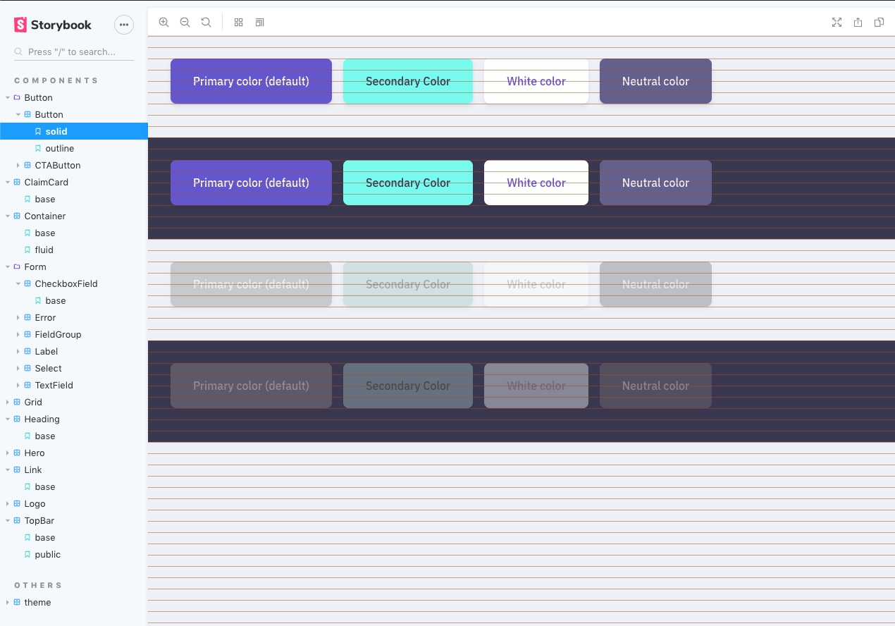

[](https://badge.fury.io/js/storybook-vrhythm)
[](https://travis-ci.org/jmlweb/storybook-vrhythm)

# Storybook Vertical Rhythm Decorator

Take an eye over the vertical rhythm of your stories with this decorator.

It should work with any framework/library, however it's only tested in a React environment for the moment.



## Installation

`npm install storybook-vrhythm --development`

or

`yarn add -D storybook-rhythm`

## Using the decorator globally

```js
import { addDecorator, addParameters } from '@storybook/react'; // or Vue, Angular...
import StorybookVRhythm from 'storybook-vrhythm';

addDecorator(VRhythm);

addParameters({
  vrhythm: {
    color: 'rgba(178,86,18,0.5)',
    lineHeight: '16px',
    offset: 0,
  },
});
```

## Using the decorator in your stories

```jsx
const stories = storiesOf('components|MyComponent', module);

stories.addParameters({ vrhythm: { hide: true } });
```

## Available options

### color

Any valid color for the lines (examples: #ff0000, rgba(0,0,0,0.3))

### lineHeight

Any valid value for the lineHeight of your system (examples: 16px, 1rem...)

### offset

The offset from the top, in case your component is wrapped or whatever.

### hide

Useful to hide the decorator in some stories
