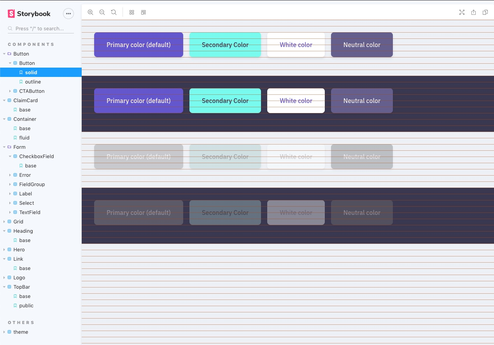

# 📐 storybook-vrhythm

[![npm package][npm-badge]][npm]
[![License: MIT][license-badge]][license]
[](https://bundlephobia.com/package/storybook-vrhythm)

**A Storybook decorator that overlays vertical rhythm guide lines on your stories.**
Verify that your components align to a baseline grid — with zero effort.



## ✨ Features

- 🎯 **Framework agnostic** — Works with React, Vue, Angular, Svelte, and any Storybook-supported framework
- 🎨 **Fully customizable** — Color, line height, offset, and visibility per story
- 🪶 **Lightweight** — Pure CSS overlay using `linear-gradient` (no images, no canvas)
- 🖱️ **Non-intrusive** — Overlay doesn't interfere with pointer events
- ⚡ **Zero config** — Works out of the box with sensible defaults

## 📦 Installation

<details open>
<summary><strong>pnpm</strong></summary>

```bash
pnpm add -D storybook-vrhythm
```

</details>

<details>
<summary><strong>npm</strong></summary>

```bash
npm install --save-dev storybook-vrhythm
```

</details>

<details>
<summary><strong>yarn</strong></summary>

```bash
yarn add -D storybook-vrhythm
```

</details>

## 🚀 Usage

This package is a **Storybook preset addon**: you can register it in `main` (recommended) or add the decorator manually in `preview`.

**Requirements:** Node.js 18+ and Storybook 8 or newer (see `peerDependencies` in `package.json`).

### Register as an addon (recommended)

Add the package to `addons` in `.storybook/main.ts` (or `main.js`). Storybook loads the preset and applies the vertical rhythm decorator in the preview iframe.

```typescript
import type { StorybookConfig } from '@storybook/react-vite'; // or your framework package

const config = {
  addons: ['storybook-vrhythm'],
} satisfies StorybookConfig;

export default config;
```

Optional defaults and overrides still use `parameters.vrhythm` in `.storybook/preview.ts`:

```typescript
export const parameters = {
  vrhythm: {
    color: 'rgba(178, 86, 18, 0.5)',
    lineHeight: '16px',
    offset: 0,
  },
};
```

### Manual decorator

If you prefer not to use the preset, import the decorator in `.storybook/preview.ts`:

```typescript
import { withVRhythm } from 'storybook-vrhythm';

export const decorators = [withVRhythm];

export const parameters = {
  vrhythm: {
    color: 'rgba(178, 86, 18, 0.5)',
    lineHeight: '16px',
    offset: 0,
  },
};
```

### Per-story configuration

Override or hide the overlay on individual stories:

```typescript
export const MyStory = {
  parameters: {
    vrhythm: {
      hide: true,
    },
  },
};
```

## ⚙️ Options

| Option       | Type               | Default                | Description                                |
| ------------ | ------------------ | ---------------------- | ------------------------------------------ |
| `color`      | `string`           | `'rgb(204, 204, 204)'` | Any valid CSS color for the guide lines    |
| `lineHeight` | `string \| number` | `'16px'`               | Baseline grid height (e.g. `16px`, `1rem`) |
| `offset`     | `string \| number` | `0`                    | Vertical offset from the top               |
| `hide`       | `boolean`          | `false`                | Hide the overlay for specific stories      |

## 💡 Why vertical rhythm?

Vertical rhythm is the practice of spacing elements on a page based on a consistent baseline grid. It improves readability and creates a sense of visual harmony. This decorator lets you **see** the grid while developing, so you can catch alignment issues before they reach production.

## 🛠️ Development

```bash
pnpm install    # Install dependencies
pnpm build      # Build the package
pnpm test       # Run tests
pnpm lint       # Lint source code
pnpm format     # Format with Prettier
```

## 🤝 Contributing

Contributions are welcome! Feel free to open an [issue](https://github.com/jmlweb/storybook-vrhythm/issues) or submit a pull request.

## 🙏 Inspiration

[Baseliner](https://jpedroribeiro.com/2015/08/baseliner-my-first-chrome-extension/) — a Chrome extension by JP Ribeiro for overlaying baseline grids.

## 📄 License

[MIT](LICENSE)

[npm-badge]: https://img.shields.io/npm/v/storybook-vrhythm.svg
[npm]: https://www.npmjs.org/package/storybook-vrhythm
[license-badge]: https://img.shields.io/badge/license-MIT-blue.svg
[license]: https://github.com/jmlweb/storybook-vrhythm/blob/master/LICENSE
